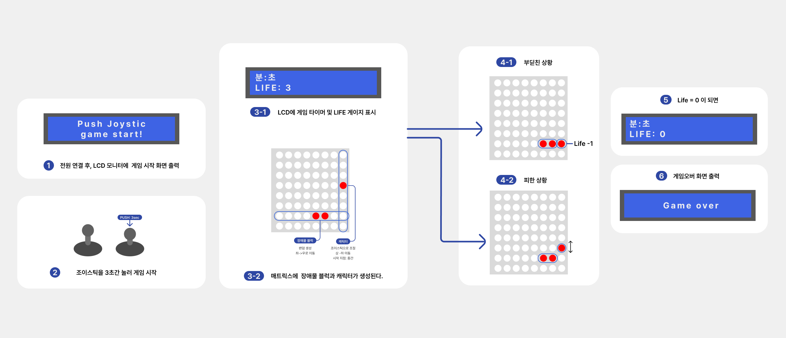

# 💻 장애물 피하기 게임  

> 아두이노를 이용해 구현한 장애물 피하기 게임 (22.08.10 ~ 22.08.12)

          
 

### 🎞️ <a href="https://player.vimeo.com/video/770017885?h=caac0de6f5&amp;badge=0&amp;autopause=0&amp;player_id=0&amp;app_id=58479">시연영상</a>
 

### 🛠️ 사용 툴 / 언어
    ⚬ Arduino IDE
    ⚬ C++
    ⚬ Arduino (UNO Board, LCD 16x4, 8x8 Matrix, PS2 Joy Stick)
### 📘 사용 라이브러리
    ⚬ <MsTimer2.h>
    ⚬ <LedControl.h>
    ⚬ <Wire.h>
    ⚬ <LiquidCrystal_I2C.h>
### 📌 기능 설명

&nbsp;1. Set Up

<pre>    ⚬ Matrix 연결 세팅  
    ⚬ 시리얼 통신 세팅 
    ⚬ Lc, Lcd 세팅 및 초기화 
    ⚬ 초기 시작 위치를 설정 
    ⚬ 플레이 시간을 나타낼 타이머를 설정 및 초기화 (기본 1초 주기)
</pre>

&nbsp;2. Start

<pre>    ⚬ 플레이 시간 측정 기능 
    ⚬ 조이스틱을 3초이상 누르면 게임을 시작하는 기능
</pre>

&nbsp;3. Player Move

<pre>    ⚬ 타이머를 통해 1초 주기로 사용자의 입력을 읽어오는 기능 
    ⚬ 조이스틱의 방향에 따라 사용자의 위치를 이동하는 기능 (+ 양쪽 모서리의 경우 움직이지 않도록 예외 처리) 
    ⚬ 조이스틱 강도에 따라 이동하는 정도를 조절하는 기능 
    ⚬ 장애물과 부딪혔을 때 생명을 하나 차감하는 기능
</pre>

&nbsp;4. Obstacle Move

<pre>    ⚬ 장애물 시작 위치를 랜덤으로 설정하는 기능 
    ⚬ 장애물이 내려오는 시간 설정 기능 (기본 1초 설정) 
    ⚬ 2칸 크기의 장애물이 정해진 시간을 주기로 한 줄씩 내려오는 기능 
    ⚬ Player와 마주쳤을 경우 장애물을 없애는 기능 
    ⚬ Player와 마주치지 않고 끝까지 내려왔을 경우 장애물을 없애는 기능
</pre>

&nbsp;5. End

<pre>    ⚬ 생명이 0이 되었을 경우 종료하는 기능 
    ⚬ 플레이한 시간을 Lcd에 표시하는 기능 
    ⚬ 일정 시간 딜레이 후, 다시 게임 시작 화면을 표시하는 기능 (기본 설정 시간 5초)      
</pre>

      

### 💡 발전 방향
    ⚬ 와이파이 모듈을 이용해 게임 점수를 웹에 등록하는 기능
    ⚬ 난이도를 선택할 수 있는 기능 (속도, 장애물 개수 조절)
    ⚬ 웹과 DB를 연동해 사용자의 순위를 비교하는 기능         

### 👩🏻‍🏫 참고 자료
    ⚬ https://www.youtube.com/watch?v=nXdEqbL_6jg
    ⚬ https://create.arduino.cc/projecthub/juanma-alvarez-plaza/arduino-catch-the-beat-8x8-led-matrix-f464b0?ref=search&ref_id=8x8&offset=17
### 👩🏻‍💻 개발자
    ⚬ 안영주 - https://github.com/dudwn1814
    ⚬ 황서영 - https://github.com/Seo0H        
  
